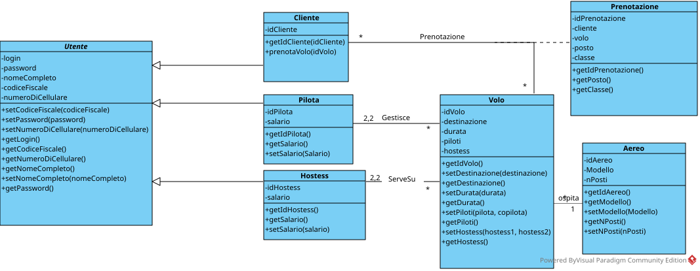

# Interazione col database

CORREZIONE ERRORE PRECEDENTE
aggiunto getPassword() mancante alla classe utente perché la sua mancanza impediva di salvare gli oggetti al database.

> in questo homework è stato creato il database con le tabelle
> * Pilota
> * Hostess
> * Cliente
> * Aereo
> * Volo
> * Prenotazione.

> abbiamo modificato il 
> codice in java per salvare i dati sul database (Tramite opportuni DAO)
> a cui siamo collegati invece che in ArrayList come veniva
> fatto in precedenza. 

> abbiamo inoltre aggiunto
> l'opzione di rimuovere un elemento da una lista, che prima era 
> assente poiché i dati non erano persistenti.
> abbiamo scritto una documentazione in JavaDoc per ogni
 >metodo utilizzato, che ne spiega scopo, eventuali parametri presi e valori restituiti.

## diagramma aggiornato

## diagramma della gui
